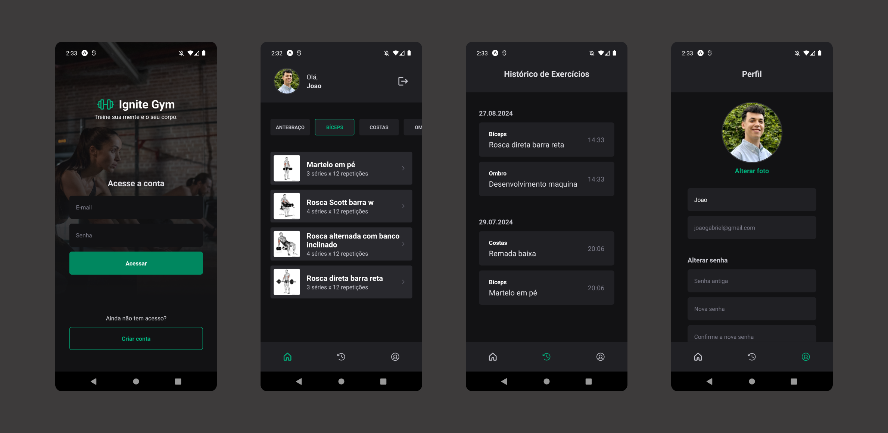

<h1 align="center"> ignitegym </h1>

  <a href="#-tecnologias">Tecnologias</a>&nbsp;&nbsp;&nbsp;|&nbsp;&nbsp;&nbsp;
  <a href="#-projeto">Projeto</a>&nbsp;&nbsp;&nbsp;|&nbsp;&nbsp;&nbsp;
  <a href="#memo-licença">Licença</a>

  

 

  

## 🚀 Tecnologias

Esse projeto foi desenvolvido com as seguintes tecnologias:

- React Native
- Expo
- TypeScript
- React Navigation
- Styled Components
- React Hook Form
- Yup
- Axios
- Async Storage

## 🔥 Algumas features neste projeto

- React Hooks
- Navegação com React Navigation Bottom Tabs
- Estilização com Styled Components
- Armazenamento de dados com async-storage
- Criação de formulários com react-hook-form
- Validação de formulários com yup
- Integração com API externa com axios
- Upload de imagens no React Native

## ✨ Neste projeto você pode ver

- Criação de conta e login do usuário feito com integração a uma API externa.
- Listagem de exercícios baseadas em cada parte do corpo.
- Informações de cada exercício como GIF animado com indicações de como fazer, tempo e números de séries indicadas.
- Histórico de exercícios marcados como feito pelos usuários.
- Edição de perfil do usuário completa com upload de imagem e outros dados.

## 💻 Projeto

- Ignite Gym é uma aplicação para auxiliar os usuários com suas rotinas de exercícios dando indicações de como executar
  e como escolher os exercícios de acordo com as partes do corpo, criada com React Native e Expo.

## ✅ Esse projeto foi criado ao longo do curso Ignite React Native da plataforma Rocketseat

## 📝 Licença

Esse projeto está sob a licença MIT.

---
